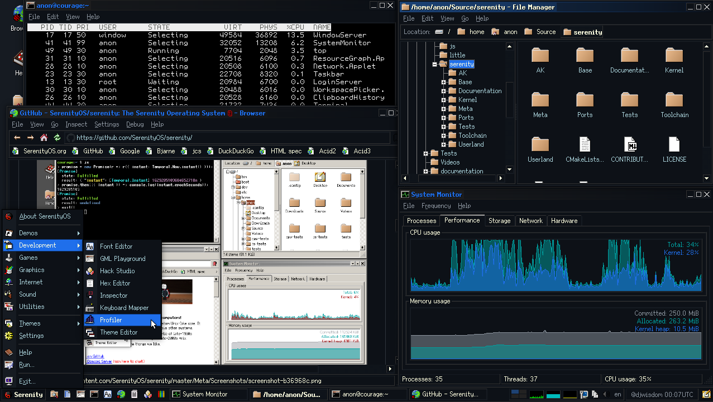

### Hi there 👋

Hello, My name is Dennis Esternon.

I wear DevOps and SysAdmin hats. 

I actively participate and contribute to SerenityOS.

I also actively contribute to https://wiki.serenityos.net and to https://fonts.serenityos.net

SerenityOS Desktop sporting Darrque Theme which I contributed to the project, the other one is named Chillychilly, along with several custom fonts.

----
Biolink account: https://bio.link/djwisdom

Polywork account: https://polywork.com/djwisdom

Twitter account: https://twitter.com/djwisdom

<!--
**djwisdom/djwisdom** is a ✨ _special_ ✨ repository because its `README.md` (this file) appears on your GitHub profile.

Here are some ideas to get you started:

- 🔭 I’m currently working on ...
- 🌱 I’m currently learning ...
- 👯 I’m looking to collaborate on ...
- 🤔 I’m looking for help with ...
- 💬 Ask me about ...
- 📫 How to reach me: ...
- 😄 Pronouns: ...
- ⚡ Fun fact: ...
-->
